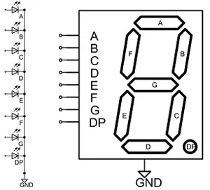

# Lab 2
## Objective
Show led on the board.

## Method
- All leds light are link, i.e. they show the same number.
  - We handle this problem by quickly disable and change the number then enable the other light, when quickly swap number the eye see all leds the different number.

## Note
- The led is anode
    - 0 is enable, 1 is disable
- `A_LED` is enable signal (4 bits)
  - E.g. 1101 enable light no. 2
- `C_LED` is seven segment controller (8 bits, the additional bit is **.** in board)
  - E.g. 0 0000001 => 0 on led, (least significant bit is **A** position)

- see more config in [constraint file.](Constraint/Constraint.xdc)